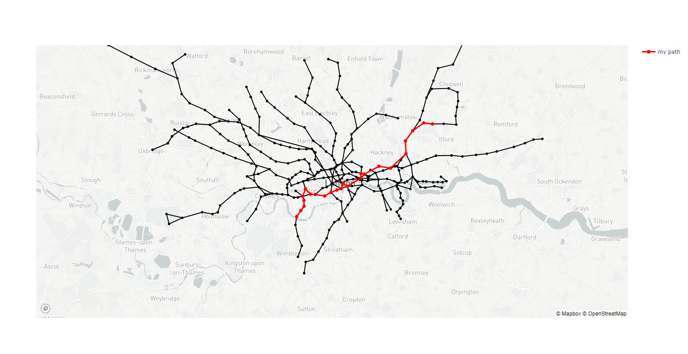
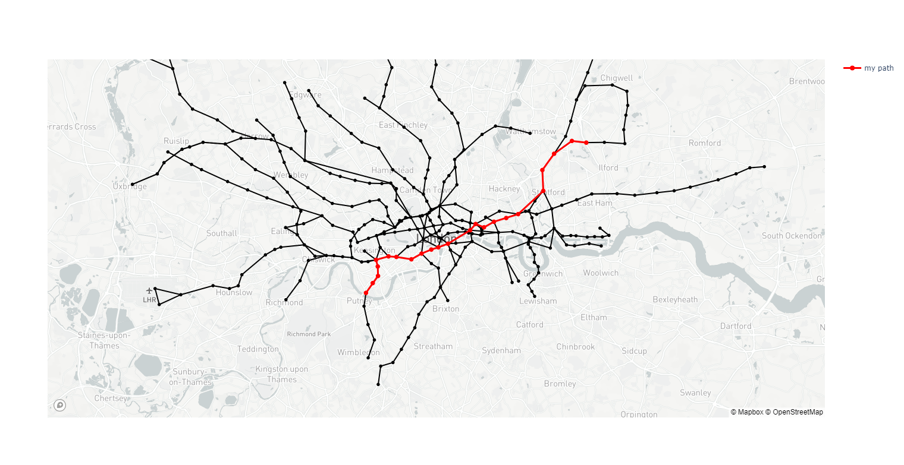
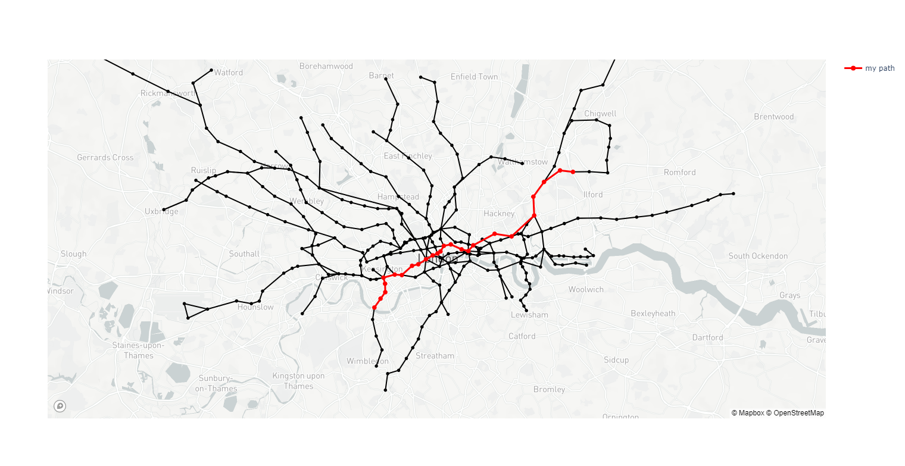

## Assignment3: Find the shortest path in underground lines

12111841 王薏寒

### Introduction

The optimization of travel routes within complex transportation networks is a fundamental problem with wide-ranging applications. And for the London Underground, an intricate and extensive subway system, it is a fascinating challenge in determining the most efficient routes between stations. In this assignment, I  Implement three algorithms, each bringing its unique approach to the problem: BFS, known for its simplicity and applicability to unweighted graphs; Bellman-Ford, a versatile algorithm suitable for graphs with weighted edges; and A*, a heuristic-based search algorithm that combines efficiency with informed decision-making.

### Data Overview:

The datasets provided includes information on underground stations, their geographical coordinates, route connections, and details about individual subway lines. Each station is represented as a node in the network, linked to neighboring stations through various subway lines.

Through `build_data.py`, the original datasets are transformed into 2 dicts: `Stations` and `underground_lines`. The `Stations` is mainly used here when implementing wayfinding. The structure of the `Stations` can be described as follows:

_Key: Station Name (str)_

* Each station is uniquely identified by its name, serving as the key in the dictionary.
* The station name is a string, allowing for easy referencing and retrieval of station information.

_Value: Station Object (Station Class)_

* The corresponding value for each station is an instance of the "Station" class, encapsulating essential attributes and functionality.
  _Attributes of the Station Class:_
  
  * **id (int):** A unique identifier for the station.
  
  * **name (str):** The name of the station.
  
  * **position (tuple):** A tuple containing the geographical coordinates (latitude, longitude) of the station.
  
  * **links (set):** A set representing adjacent stations directly connected to the current station.

### Problems and Algorithm Implementation

#### Breadth-First Search

When approaching the problem from its simplest perspective, we can simplify it to the task of finding the shortest path between two nodes in an undirected and unweighted graph. To tackle this, I initially considered the Breadth-First Search (BFS) algorithm:

```python
def get_path_bfs(start_station_name: str, end_station_name: str, map: dict[str, Station]) -> List[str]:

    start_station = map[start_station_name]
    end_station = map[end_station_name]

    queue = deque([start_station])
    visited = set()

    path = {start_station: None}

    while queue:
        current_station = queue.popleft()
        visited.add(current_station)

        if current_station == end_station:
            return reconstruct_path(path, end_station)

        for neighbor in current_station.links:
            if neighbor not in visited:
                queue.append(neighbor)
                path[neighbor] = current_station

    raise Exception("Path does not exist")
```

1. **Initialization:**
   
   * `start_station` and `end_station` are retrieved from the provided map using the given station names.
   * `queue` is initialized as a deque with the starting station, preparing for BFS exploration.
   * `visited` is an empty set to keep track of visited stations.
   * `path` is a dictionary where each station is mapped to its predecessor in the path. And the start station's predecessor is setted as None.

2. **BFS Exploration:**
   
   * Begin the main loop, which continues until the `queue` is empty. This ensures that all reachable stations have been explored.
   * In each iteration:
     * Pop the leftmost station from the queue, mark it as the current station.
     * Mark the current station as visited.
     * Check if the current station is the destination. If so, reconstruct the shortest path and return it.
     * If the current station is not the destination, proceed to explore its neighbors.

3. **Exploring Neighbors:**
   
   * For each neighbor of the current station:
     * Check if the neighbor has been visited.
     * If the neighbor has not been visited:
       * Add the neighbor to the queue for further exploration.
       * Record the path from the current station to the neighbor in the `path` dictionary.

4. **Path Reconstruction:**
   
   * The `reconstruct_path` function is called to reconstruct the shortest path based on the recorded path information.

_Reconstructing Path Function:_

```python
def reconstruct_path(path, end_station):
    result = [end_station.name]
    while path[end_station]:
        end_station = path[end_station]
        result.append(end_station.name)
    return result[::-1]
```

* `reconstruct_path` takes the `path` dictionary and the destination station as input.
* It reconstructs the path by backtracking from the destination to the starting station.
* The resulting path is reversed to provide the correct order from start to end.

#### Bellman-Ford

However, in reality, even the linear distance between different subway stations is different, so I regard the linear distance between stations as the weight of the side, and use Bellman Ford algorithm to find the shortest distance.

_The basic steps of the Bellman-Ford algorithm_

1. **Initialization:** Set the distance of the source node to 0 and the distances of all other nodes to infinity. 

2. **Iteration:** Perform |V| - 1 iterations, where |V| is the number of nodes in the graph. In each iteration, traverse all edges, attempting to update the distance of the target node using the current known shortest paths.

3. **Detecting Negative Cycles:** Perform the |V|-th iteration. If, during this iteration, a node's distance can still be reduced through edge relaxation, then a negative-weight cycle exists in the graph.

_The basic steps of the Bellman-Ford algorithm_

```python
def get_path_Bellman_Ford(start_station_name: str, end_station_name: str, map: dict[str, Station]) -> List[str]:

    start_station = map[start_station_name]
    end_station = map[end_station_name]

    weight = {station: math.inf for station in map.values()}
    predecessor = {station: None for station in map.values()}
    weight[start_station] = 0

    for _ in range(len(map) - 1):
        for station in map.values():
            for neighbor in station.links:
                edge_weight = distance(station, neighbor)
                if weight[station] + edge_weight < weight[neighbor]:
                    weight[neighbor] = weight[station] + edge_weight
                    predecessor[neighbor] = station

    for station in map.values():
        for neighbor in station.links:
            edge_weight = distance(station, neighbor)
            if weight[station] + edge_weight < weight[neighbor]:
                raise Exception("Negative weight cycle detected. No shortest path exists.")

    path = []
    current_station = end_station
    while current_station:
        path.insert(0, current_station.name)
        current_station = predecessor[current_station]

    return path

def distance(station1, station2):
    return ((station1.position[0] - station2.position[0]) ** 2 + (station1.position[1] - station2.position[1]) ** 2) ** 0.5
```

1. **Initialization:**
   
   * `start_station` and `end_station` are obtained from the provided map using the specified station names.
   * Dictionaries `weight` and `predecessor` are initialized for each station. `weight` tracks the shortest known distance from the starting station, and `predecessor` records the predecessor station in the shortest path.

2. **Relaxation Iterations:**
   
   * The algorithm performs a series of relaxation iterations to update weights based on distances (Euclidean distance calculated by `distance`).
   * For each station, it iterates through its neighbors, calculating the edge weight (distance) between the station and its neighbor.
   * If updating the weight through the current station results in a shorter path, the weight and predecessor are updated.

3. **Negative Weight Cycle Check:**
   
   * After relaxation iterations, an additional check is performed to detect negative weight cycles.
   * It iterates through each station and its neighbors, checking if further weight reduction is possible. If yes, a negative weight cycle is detected, and an exception is raised.

4. **Path Reconstruction:**
   
   * The shortest path is reconstructed by backtracking from the destination station to the source station.
   * The stations' names are inserted into the path list, ensuring the correct order from source to destination.

5. **Return Result:**
   
   * The reconstructed path is returned as the result, representing the shortest route between the specified starting and ending stations. 

#### A* Algorithm

In addition to the BFS and Bellman-Ford algorithms, the A* algorithm is employed to find the shortest path between two stations in the London Underground network. A* incorporates heuristics to guide the search efficiently. Below is a comprehensive breakdown of the A* algorithm and its execution:

```python
def get_path_Astar(start_station_name: str, end_station_name: str, map: dict[str, Station]) -> List[str]:

    start_station = map[start_station_name]
    end_station = map[end_station_name]

    open_list = [start_station]
    closed_list = set()

    path = {start_station: None}
    cost = {start_station: 0}

    while open_list:
        current_station = min(open_list, key=lambda station: cost[station] + heuristic(station, end_station))
        open_list.remove(current_station)
        closed_list.add(current_station)

        if current_station == end_station:
            return reconstruct_path(path, end_station)

        for neighbor in current_station.links:
            if neighbor in closed_list:
                continue

            tentative_cost = cost[current_station] + distance(current_station, neighbor)
            if neighbor not in open_list or tentative_cost < cost[neighbor]:
                open_list.append(neighbor)
                path[neighbor] = current_station
                cost[neighbor] = tentative_cost

    raise Exception("Path does not exist")

def heuristic(station, end_station):
    return distance(station, end_station)

def distance(station1, station2):
    return ((station1.position[0] - station2.position[0]) ** 2 + (station1.position[1] - station2.position[1]) ** 2) ** 0.5
```

1. **Initialization:**
   
   * The starting and ending stations, `start_station` and `end_station`, are extracted from the provided map using the specified station names.
   * Open list (`open_list`) is initialized with the starting station, and the closed list (`closed_list`) is set initially as an empty set.
   * Dictionaries `path` and `cost` are initialized for each station. `path` records the predecessor in the current path, and `cost` stores the cost incurred to reach each station.

2. **Main Loop:**
   
   * The algorithm iterates until the open list is empty.
   * The station with the minimum cost plus heuristic is selected from the open list as the current station.
   * The current station is moved from the open list to the closed list.

3. **Goal Check:**
   
   * If the current station is the destination station, the shortest path is reconstructed and returned.

4. **Exploring Neighbors:**
   
   * For each neighbor of the current station:
     * If the neighbor is in the closed list, skip it.
     * Calculate the tentative cost to reach the neighbor from the current station.
     * If the neighbor is not in the open list or the tentative cost is lower than the recorded cost, update the open list, path, and cost for the neighbor.

5. **Path Reconstruction:**
   
   * If the goal is reached, the shortest path is reconstructed by backtracking from the destination station to the source station.

6. **Return Result:**
   
   * The reconstructed path is returned as the result, representing the shortest route between the specified starting and ending stations.

*heuristic(station, end_station)*

- The heuristic function is crucial in A* to guide the search by providing an estimate of the remaining cost to reach the goal. In this implementation, the heuristic is simply the Euclidean distance (calculated by `distance`) between the current station and the destination.

_Try another heuristic function_

- Manhattan Distance:

```python
def heuristic_manhattan(station, end_station):
    return abs(station.position[0] - end_station.position[0]) + abs(station.position[1] - end_station.position[1])
```

- Chebyshev Distance:

```python
def heuristic_chebyshev(station, end_station):
    return max(abs(station.position[0] - end_station.position[0]), abs(station.position[1] - end_station.position[1]))
```

### Results and Analysis

#### Direct Result

Here I will visually show the results of the three algorithms, and the selected sites are from Putney Bridge to Redbridge, here time is for `plot_path` :

- The Breadth-First Search Result: 24 stations
  Elapsed Time: 0.612598180770874 seconds



- A* (the Euclidean distance and the Chebyshev distances) and Bellman-Ford Result: 23 stations
  - Bellman-Ford: Elapsed Time: 0.6125421524047852 seconds
  - A* (the Euclidean distance): Elapsed Time: 0.6290342807769775 seconds
  - A* (the Chebyshev distances): Elapsed Time: 0.617222785949707 seconds



- A* (the Manhattan distance) Result: 25 stations
  
  Elapsed Time: 0.6177170276641846 seconds

 

#### Time and Space Complexity

1. **BFS:**
   
   * **Time Complexity:** O(V + E), where V is the number of vertices and E is the number of edges.
   * **Space Complexity:** O(V), where V is the number of vertices.

2. **A* (with Euclidean, Chebyshev, and Manhattan Heuristics):**
   
   * **Time Complexity:** Depends on the efficiency of the heuristic. In practice, A* can be faster than BFS due to its heuristic-guided nature.
   * **Space Complexity:** O(V), where V is the number of vertices.

3. **Bellman-Ford:**
   
   * **Time Complexity:** O(V * E), where V is the number of vertices and E is the number of edges.
   * **Space Complexity:** O(V), where V is the number of vertices.

#### Comparison and Insights

* _BFS vs. A* vs. Bellman-Ford_:
  
  * BFS provides the shortest path in unweighted graphs but may not be the most efficient for larger, weighted graphs.
  * A* algorithms are mostly guided by heuristics.
  * Bellman-Ford is suitable for graphs with negative weights has a same time complexity with BFS.

* _A Heuristic Comparison:_
  
  * The choice of heuristic affects the performance of A*. The Euclidean and Chebyshev distances resulted in similar elapsed times, emphasizing their adaptability to the London Underground network's geography.
  * The Manhattan distance, while still effective, required slightly more stations to reach the destination.

### Conclusion

In summary, the choice of algorithm depends on the characteristics of the graph, and the A* algorithm, with appropriately chosen heuristics, can provide an efficient and effective solution for finding the shortest path between two stations in the London Underground network. The trade-off between time and space complexity should be considered based on the specific requirements of the application.

### New File Description

* [visualization_underground](visualization_underground)
  
  * [my_shortest_path_in_London_railway_BFS.html](visualization_underground%2Fmy_shortest_path_in_London_railway_BFS.html)
  * [my_shortest_path_in_London_railway_Bellman_Ford.html](visualization_underground%2Fmy_shortest_path_in_London_railway_Bellman_Ford.html)
  * [my_shortest_path_in_London_railway_Astar_Euclidean.html](visualization_underground%2Fmy_shortest_path_in_London_railway_Astar_Euclidean.html)
  * [my_shortest_path_in_London_railway_Astar_chebyshev.html](visualization_underground%2Fmy_shortest_path_in_London_railway_Astar_chebyshev.html)
  * [my_shortest_path_in_London_railway_Astar_manhattan.html](visualization_underground%2Fmy_shortest_path_in_London_railway_Astar_manhattan.html)

* [find_shortest_path.py](find_shortest_path.py) (Implements)

* [pictures](pictures) (The pictures uesd in this report)

* [Report.md](Report.md)
